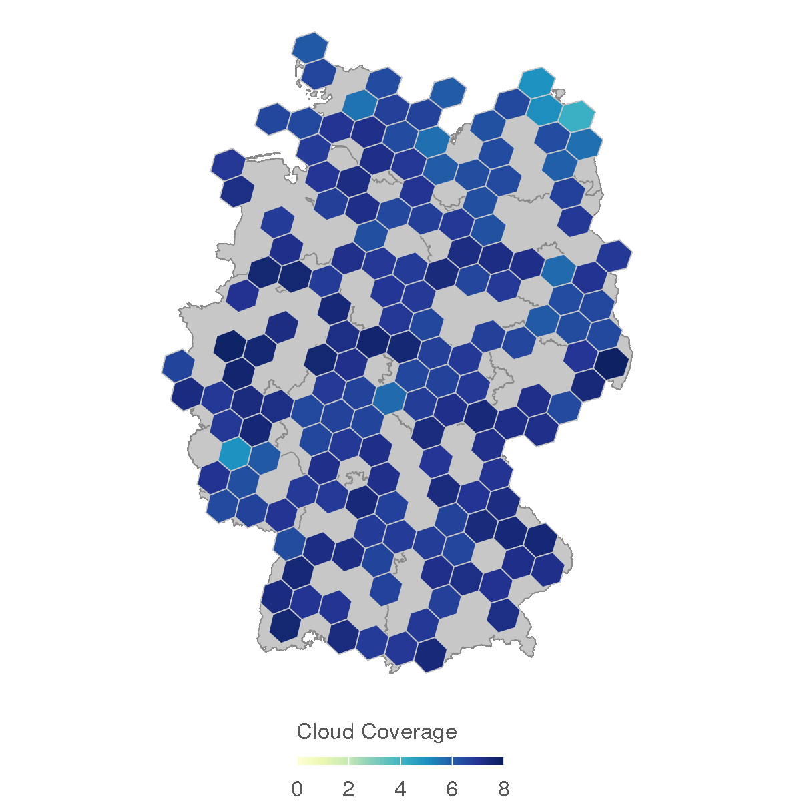

# Animations in R

This repository contains a collection of R scripts that demonstrate how
to create animations in R.

## Animation of Spatial Data

This section shows how to animate spatial data.

### German Weather Service Data

The German Weather Service (Deutscher Wetterdienst, DWD) provides
weather and climate data for Germany. The following scripts use DWD data
to create animations:

-   [Cloudiness in Germany](Deutsche-Wetterdienst/Cloudiness.R)
-   [Air Temperature in Germany](Deutsche-Wetterdienst/Temperature.R)

{width="80%"}
